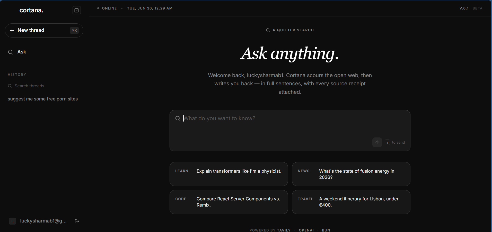
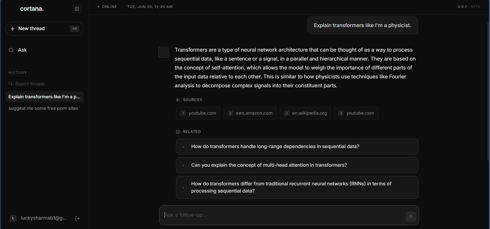
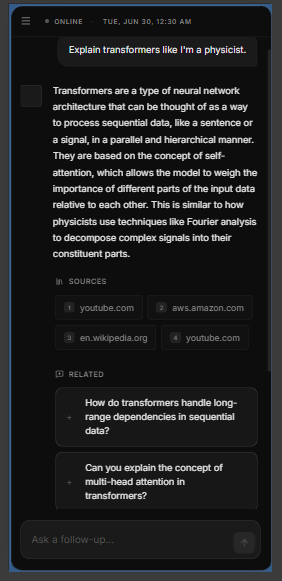

# Cortana — AI Search Engine 🧠🔍

Cortana is a powerful, AI-driven search application that scours the open web to provide real-time intelligence. It writes comprehensive, full-sentence answers and automatically attaches source receipts for maximum accuracy and trustworthiness. 

Built with a highly responsive, modern dark-themed aesthetic, Cortana is designed to offer a premium, "quieter" search experience.

## ✨ Features
- **Real-Time Web Search:** Powered by Tavily API for up-to-date web intelligence.
- **Conversational AI:** OpenAI integration for intelligent synthesis and follow-up capabilities.
- **Streaming Responses:** Smooth, real-time typing effect as the AI gathers and processes information.
- **Source Transparency:** Automatically attaches cited source URLs (receipts) to every answer.
- **Responsive Design:** A fully responsive, modern dark-mode dashboard tailored for both desktop and mobile.
- **Secure Authentication:** Integrated with Supabase Auth (Google & GitHub login).
- **Persistent Threads:** All search history is securely saved and retrievable via PostgreSQL.

---

## 📸 Screenshots


### Dashboard Overview
> *A clean, dark-themed interface for distraction-free search.*


### Real-Time AI Streaming


### Mobile Responsiveness


---

## 🚀 Tech Stack

- **Frontend:** React, TypeScript, Tailwind CSS, Shadcn UI
- **Backend:** Node.js, Express, Bun, Prisma ORM
- **Database:** PostgreSQL (via Supabase)
- **AI & Data:** OpenAI API, Tavily API, Vercel AI SDK

## 🛠️ Getting Started

### Prerequisites
- [Bun](https://bun.sh/)
- Node.js (v18+)
- A PostgreSQL Database (Supabase recommended)
- OpenAI API Key & Tavily API Key

### Installation

1. **Clone the repository:**
   ```bash
   git clone https://github.com/Lucky-Sharma/Data-extractor.git
   cd Data-extractor
   ```

2. **Setup Backend:**
   ```bash
   cd backend
   bun install
   ```
   Create a `.env` file in the `backend` directory based on the provided variables (e.g., `DATABASE_URL`, `SUPABASE_API_KEY`, `TAVILY_API_KEY`, `CF_AIG_TOKEN`).
   Run migrations:
   ```bash
   bunx prisma db push
   ```
   Start the backend:
   ```bash
   bun index.ts
   ```

3. **Setup Frontend:**
   ```bash
   cd ../frontend
   npm install
   ```
   Create a `.env` file in the `frontend` directory with your Supabase public URLs.
   Start the development server:
   ```bash
   npm run dev
   ```

## 📜 License
This project is licensed under the MIT License.
